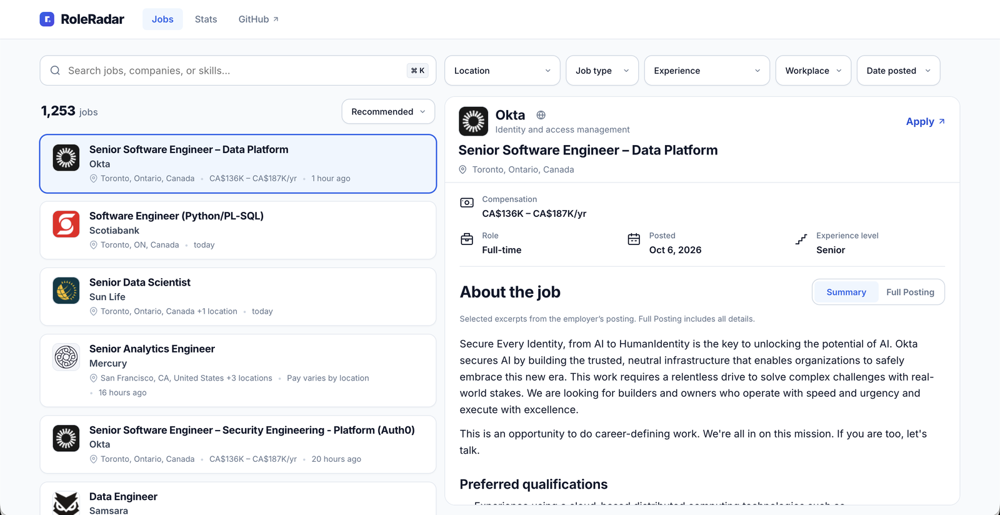
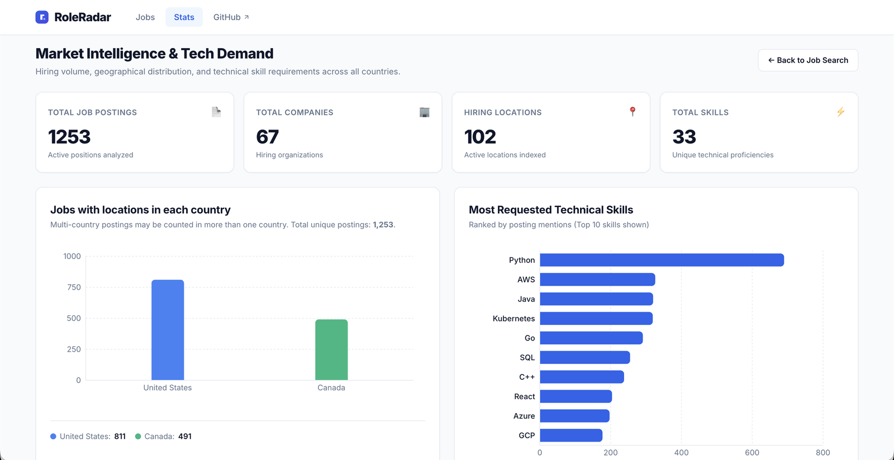
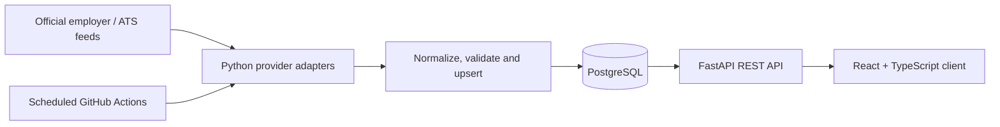

# RoleRadar

**Canada-first software engineering job search, built from official company career pages.**

RoleRadar (formerly Jobber) brings postings from different hiring platforms into one searchable interface. It prioritizes Canadian co-op, internship and early-career opportunities while retaining US roles, and lets applicants compare jobs without opening a new page for every posting.

**[Live demo](https://jobber-mauve.vercel.app/jobs)** · **[Market dashboard](https://jobber-mauve.vercel.app/stats)** · **[CI results](https://github.com/imabhi25/Jobber/actions/workflows/ci.yml)**

[](https://github.com/imabhi25/Jobber/actions/workflows/ci.yml)

> **Naming.** The project was renamed from Jobber to RoleRadar. Deliberately unchanged so nothing breaks: the GitHub repository and its URLs
> (`imabhi25/Jobber`), the live address `jobber-mauve.vercel.app` and the API host, the database name `jobber` and the SQL functions
> `jobber_pay_ranges` / `jobber_experience_level`, and the applied migrations (history). The earlier audit reports in this repository
> (`JOBBER_QA_AUDIT.md`, `REMEDIATION_REVIEW.md`, `COVERAGE_EXPANSION_REPORT.md`, `CANDIDATE_EMPLOYERS_AUDIT.md`) keep the old name as historical records.
> The employer "Jobber" in `config/company_watchlist.json` is a real company (getjobber.com), not this project.

## Screenshots





## Quickstart

Prerequisites: Python 3.12+, Node.js 22 and PostgreSQL 16. Run the API and the UI in two terminals.

```bash
# 1. Backend and database
git clone https://github.com/imabhi25/RoleRadar.git && cd RoleRadar
python3 -m venv .venv && source .venv/bin/activate
python -m pip install -r requirements.txt
createdb roleradar && export PGDATABASE=roleradar
psql -v ON_ERROR_STOP=1 -d roleradar -f db/schema.sql && python -m db.migrate

# 2. Load real postings from one employer, then start the API (http://127.0.0.1:8000/docs)
python -m ingestion.cli --company Figma
python -m uvicorn api.main:app --reload

# 3. In a second terminal, start the UI (http://localhost:5173)
cd frontend && npm ci && npm run dev
```

Full setup, all employers and the test commands are in [Run locally](#run-locally) below.

## What the app does

- **Search and compare:** automatically selected split view on desktop, a detail modal on mobile, pagination and shareable search/filter URLs.
- **Find relevant roles:** location, job type, experience, workplace and date filters, with Canada-first recommended ordering.
- **Read useful summaries:** responsibilities, qualifications, benefits and key applicant conditions drawn from the source posting, with a smooth toggle to the complete posting.
- **Explore employers:** company profiles, official branding and application links beside the company name.
- **Understand the market:** charts for geography and skill demand, alongside posting and employer counts.

For a quick tour, search for a company, apply a job-type filter, switch between Summary and Full Posting, then open the market dashboard.

## Engineering highlights

This project covers the full path from external data collection to a deployed interface. The main engineering challenges are inconsistent source data, reliable job lifecycle management and presenting useful information without inventing facts.

| Challenge | Implementation | Code |
| --- | --- | --- |
| Hiring platforms expose different formats | Provider adapters convert records into a shared model; normalization extracts role, location, skills and compensation metadata. | [Adapters](ingestion/clients/), [shared model](ingestion/base.py), [normalizer](ingestion/normalizer.py) |
| Refreshes must avoid duplicates and accidental mass removals | Idempotent upserts, source identifiers and sync audit records; incomplete or failed snapshots cannot deactivate existing jobs, and suspicious drops require confirmation. | [Pipeline](ingestion/pipeline.py), [migrations](db/migrations/) |
| Search must stay consistent as users type and filter | Server-side search and pagination, normalized search text, URL-backed state and cancellation of superseded requests. | [API](api/main.py), [search normalization](api/search_text.py), [jobs view](frontend/src/components/JobExplorer.tsx), [URL state](frontend/src/utils/urlState.ts) |
| Descriptions contain noisy or unsafe HTML | DOMPurify sanitization and a shared description pipeline; summaries retain whole source blocks and prioritize qualifications and eligibility conditions. | [Sanitization](frontend/src/utils/sanitizeDescription.ts), [description pipeline](frontend/src/utils/descriptionPipeline.ts), [summary selection](frontend/src/utils/postingSummary.ts) |
| Data quality affects applicant decisions | Salary plausibility guards, readable location formatting and experience classification backed by regression tests. | [Compensation](ingestion/compensation.py), [frontend tests](frontend/tests/), [backend tests](tests/) |

## Architecture and stack



| Layer | Technologies |
| --- | --- |
| Frontend | React 19, TypeScript, Vite, Recharts, Inter, DOMPurify |
| API and ingestion | Python, FastAPI, psycopg2, Requests, Beautiful Soup |
| Storage | PostgreSQL 16, relational schema, versioned SQL migrations |
| Quality checks | pytest with PostgreSQL integration tests, Vitest, React Testing Library, ESLint, TypeScript |
| Delivery | GitHub Actions, Vercel frontend, separately hosted API |

The adapter registry includes Greenhouse, Lever, Ashby, Workday, Amazon, Google, Shopify, Phenom and SuccessFactors, plus additional discovery/source clients. Public listings use eligible, active official-source records. Discovery candidates are tracked and verified separately from public jobs.

The [ingestion workflow](.github/workflows/ingest_jobs.yml) is scheduled every three hours. Companies and source identifiers are configured in [the target registry](config/target_companies.json).

## Testing and reliability

The [CI workflow](.github/workflows/ci.yml) checks pull requests and changes to `main`:

- Backend tests run against PostgreSQL 16 after applying the schema and migrations. CI fails if database-dependent tests are skipped.
- Frontend tests cover interactions, filtering, request races, dates, compensation, locations, description safety and Summary/Full Posting behavior.
- ESLint, TypeScript, a production build and a whitespace check run alongside the test suites.

**571 frontend tests passed for the [latest feature release](https://github.com/imabhi25/Jobber/pull/4) on October 4, 2026.** This is a dated test-suite result; live listing counts and source availability change over time.

## Run locally

Prerequisites: **Python 3.12+, Node.js 22 and PostgreSQL 16**. Commands below use bash/zsh and a local PostgreSQL installation that your current user can access.

<details>
<summary><strong>Setup, ingestion and development commands</strong></summary>

### 1. Install backend dependencies

```bash
git clone https://github.com/imabhi25/Jobber.git
cd Jobber
python3 -m venv .venv
source .venv/bin/activate
python -m pip install -r requirements.txt
```

### 2. Initialize a fresh local database

```bash
createdb jobber
export PGDATABASE=jobber
psql -v ON_ERROR_STOP=1 -d jobber -f db/schema.sql
python -m db.migrate
```

The API and ingestion scripts accept `DATABASE_URL` or PostgreSQL's `PGHOST`, `PGPORT`, `PGUSER`, `PGPASSWORD` and `PGDATABASE` variables. If you use a connection URI, export it for Python and use that same URI with `psql` when applying the schema. The root [`.env.example`](.env.example) documents configuration; backend variables must be exported into the shell.

### 3. Fetch official job postings

```bash
# Preview one configured source without database writes.
python -m ingestion.cli --company Figma --dry-run

# Populate the local job feed from that source.
python -m ingestion.cli --company Figma

# Optional: sync all configured companies.
python -m ingestion.cli --all
```

These commands require network access; availability and results depend on the employer's source. The included `data/sample_jobs.csv` contains fictional examples for the original CLI and database loader. Sample rows are excluded from the public job-search feed.

### 4. Start the API and frontend

In the backend terminal:

```bash
python -m uvicorn api.main:app --reload
```

In another terminal, from the repository root:

```bash
cd frontend
npm ci
npm run dev
```

Open [http://localhost:5173](http://localhost:5173). Development requests default to the API at `http://127.0.0.1:8000`. Interactive API documentation is available at [http://127.0.0.1:8000/docs](http://127.0.0.1:8000/docs).

To change the frontend API target, set `VITE_API_BASE_URL` in `frontend/.env.local` and restart Vite. Production cross-origin API URLs must use HTTPS; backend CORS origins are configured with `FRONTEND_ORIGIN`.

### 5. Run the checks

Initialize a separate local database for backend tests:

```bash
python -m pip install pytest httpx
createdb jobber_test
export PGDATABASE=jobber_test
psql -v ON_ERROR_STOP=1 -d jobber_test -f db/schema.sql
python -m db.migrate
TESTING=1 python -m pytest -q -rs
```

If you configured `DATABASE_URL`, point it to this test database as well; it takes precedence over `PGDATABASE`.

Frontend checks, from `frontend/`:

```bash
npm test
npm run lint
npm run build
```

`npm run build` performs TypeScript checking before building. Backend integration tests may skip if PostgreSQL or migrations are missing; CI explicitly rejects skipped tests.

</details>

## Repository guide

| Path | Purpose |
| --- | --- |
| [`frontend/`](frontend/) | Application UI, reusable components and frontend tests |
| [`api/`](api/) | Job search, company, statistics and source-health endpoints |
| [`ingestion/`](ingestion/) | Source adapters, extraction, normalization, discovery and synchronization |
| [`db/`](db/) | Schema, migrations and idempotent CSV loader |
| [`config/`](config/) | Target companies and discovery watchlist |
| [`tests/`](tests/) | Backend, adapter, ingestion and data-quality regression tests |
| [`.github/workflows/`](.github/workflows/) | CI, scheduled ingestion and database migration workflows |
| [`main.py`](main.py), [`data/`](data/) | Original CSV analytics CLI and fictional sample data |

## Scope and data freshness

RoleRadar links applicants to employer application pages; it does not submit applications. Source outages and incomplete metadata are expected: sync status is tracked, useful records are preserved during failed refreshes, and missing details remain absent rather than being invented. Summaries select source excerpts; Full Posting remains available for complete context. Listing counts change as employers publish and close roles.
